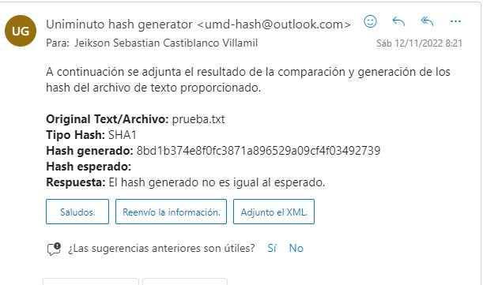

# ms-email

- ¿QUE ES?

Es un microservicio en el cual la funcionalidad es el envio de correo con un contenido especifico, desde un usuario fijo a un destinatario ingresado.

- LIBRERIA IMPLEMENTADA

La libreria que permite el funcionamiento del correo es emailer express node

- CONTENIDO DE EL ENVIO DE CORREO 

El correo contiene los siguientes datos; texto o archivo original, el hash que se genero previamente, tipo de hash, validacio de si el hash generado es igual al esperado.

- ¿COMO SE EJECUTA?
Desde una terminal ingresar: node index.js. para poder iniciar el servicio 

